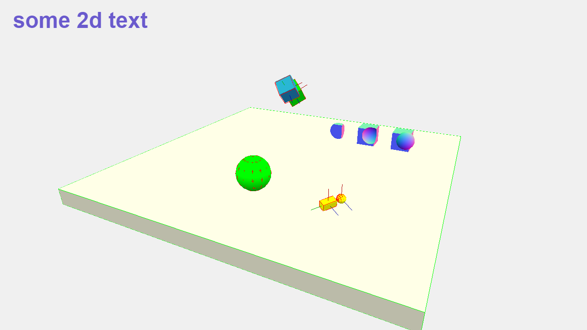

# Three.js & ammo.js (enable3d)



---

## Example of Three.js with ammo.js

- Contains a **CSG Example with BufferGeometries**.
- Contains the **Flat Package for 2D Elements**.

## Projects

The `index.ts` file contains to different project:

- `three.ts` file contains a three.js project with Enable3d's **Physics Extension**.
- `standalone.ts` file contains a **Standalone Enable3d** project.

## Install & Run

```console
# download this repo
npx gitget enable3d/threejs-ammojs-webpack-example enable3d-webpack

# navigate into the directory
cd enable3d-webpack

# install
npm install

# start
npm start
```

## Dependencies

The only dependency is `enable3d`. All other dependencies (three.js etc.), are installed with `enable3d`.
